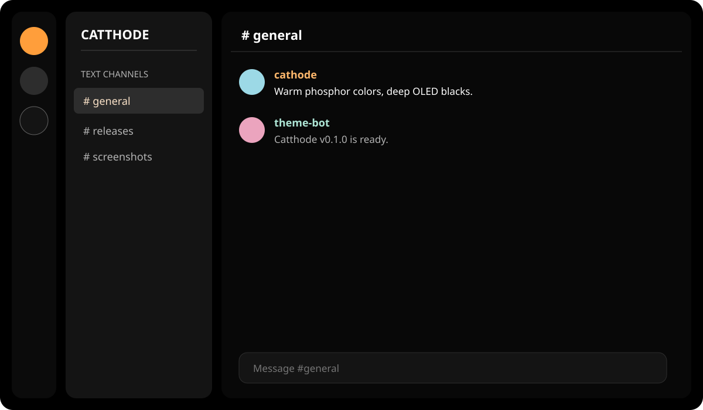

# Catthode for Discord

> **From CRT to OLED.** Bringing warmth back to a world of cold themes. [cattho.de](https://cattho.de/)

A warm, true-black Discord theme for Vencord and BetterDiscord. It maps Discord's public design tokens instead of generated class names, keeping the port compact and less brittle.



## Install

### Vencord

1. Download [`catthode.theme.css`](catthode.theme.css).
2. Open **Settings → Vencord → Themes → Open Themes Folder**.
3. Put the file there and enable **Catthode**.

You can also paste this URL into Vencord's **Online Themes** box:

```text
https://raw.githubusercontent.com/catthode/discord/main/catthode.theme.css
```

### BetterDiscord

1. Download [`catthode.theme.css`](catthode.theme.css).
2. Open **Settings → BetterDiscord → Themes → Open Themes Folder**.
3. Put the file there and enable **Catthode**.

## Validation

CI checks the metadata, rejects generated Discord class selectors, lints the CSS, and renders a browser-only fixture. A real signed-in Discord client check remains on the project checklist before directory submissions.

## License

MIT
