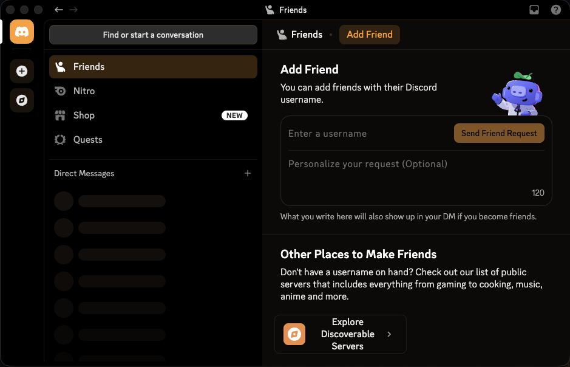

# Catthode for Discord

> **From CRT to OLED.** Bringing warmth back to a world of cold themes. [cattho.de](https://cattho.de/)

A warm, true-black Discord theme for Vencord and BetterDiscord. It maps Discord's public design tokens instead of generated class names, keeping the port compact and less brittle.



## Install

### Vencord

1. Download [`catthode.theme.css`](catthode.theme.css).
2. Open **Settings → Vencord → Themes → Open Themes Folder**.
3. Put the file there and enable **Catthode**.

You can also paste this URL into Vencord's **Online Themes** box:

```text
https://raw.githubusercontent.com/catthode/discord/main/catthode.theme.css
```

### BetterDiscord

1. Download [`catthode.theme.css`](catthode.theme.css).
2. Open **Settings → BetterDiscord → Themes → Open Themes Folder**.
3. Put the file there and enable **Catthode**.

## Validation

The 0.2.0 pass uses border-led section delineation across the server rail, channel list, chat header, member list, composer, attachments, settings, and voice panels while keeping true black as the base. Hover, selected, mention, unread, focus, and pressed states stay in the warm Catthode palette; no bitmap texture or telemetry is added.

CI checks the metadata, rejects generated Discord class selectors, and lints the CSS. The checked-in `preview/catthode-discord.png` is an anonymous Vesktop capture of the Friends/Add Friend surface, and a disposable signed-in empty-profile check covers the current visual-refresh surfaces. A read-only public-server preview pass also covered channels, welcome messages, profile popovers, and Voice & Video settings without joining the server or sending messages. Actual calls and any community-directory submission remain separate manual/optional steps.

## License

MIT
